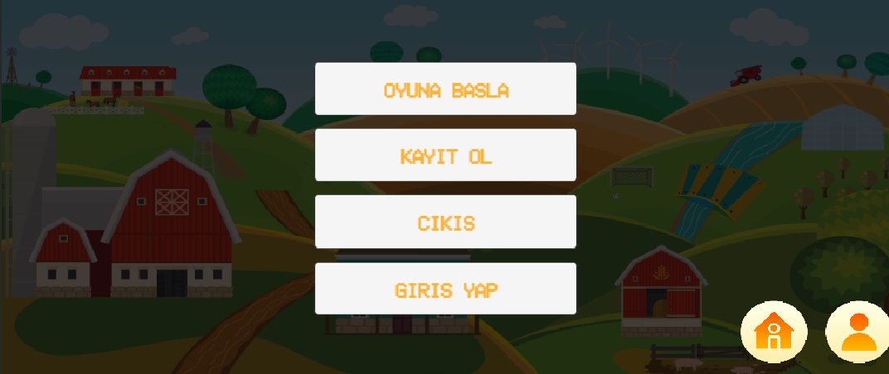
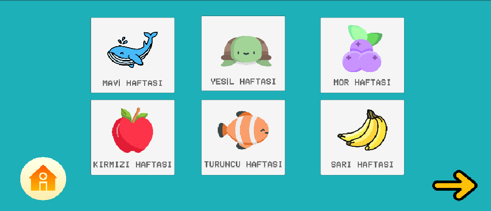
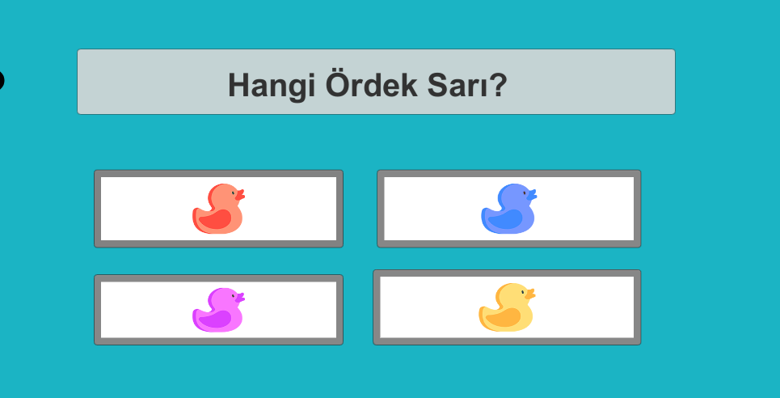

# ColorMe 🎨

**ColorMe** is a Unity-based educational game designed to help children with autism learn colors in an engaging and structured way.

---

## 🧠 Project Goal

The goal of this project is to support children with autism in learning colors, which can often be a challenging and abstract concept. ColorMe helps make the learning process more accessible and fun through visuals, interactive questions, and sound reinforcement.

---

## 🌈 How It Works

- The game consists of **weekly color-themed modules**.
- Each module introduces a new color through images and audio.
- Players are guided through a series of **questions**, where they must choose the correct color based on instructions.
- Correct answers turn **green**, wrong answers turn **red**, providing instant feedback.
- After completing the quiz, players are shown a **summary screen** with their score.

---

## 📸 Screenshots

### Main Menu  


### Color Weeks Selection  


### Question and Answer Screen  


---

## 🛠️ Technologies Used

- Unity Game Engine
- C# Programming Language
- Visual Studio

---

## 🚀 Getting Started

1. Clone the repository:
   ```bash
   git clone https://github.com/berraapcin/ColorMe.git
   ```
2. Open the project in **Unity Hub**.
3. Press **Play** to test the game.


---

## 📚 Sources

- https://www.wikihow.com/Teach-Your-Child-Colors  
- https://www.huseyinbedir.com.tr/unity-2d-ile-sahneler-arasi-gecis  
- https://www.flaticon.com/  
- https://www.youtube.com/watch?v=G9QDFB2RQGA&t=203s
